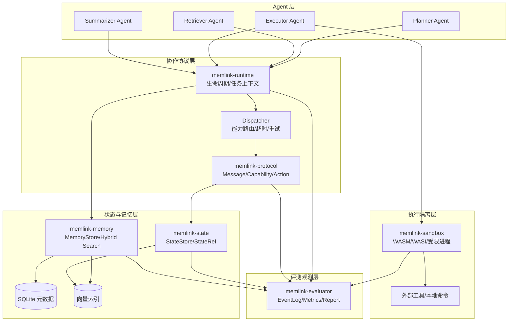
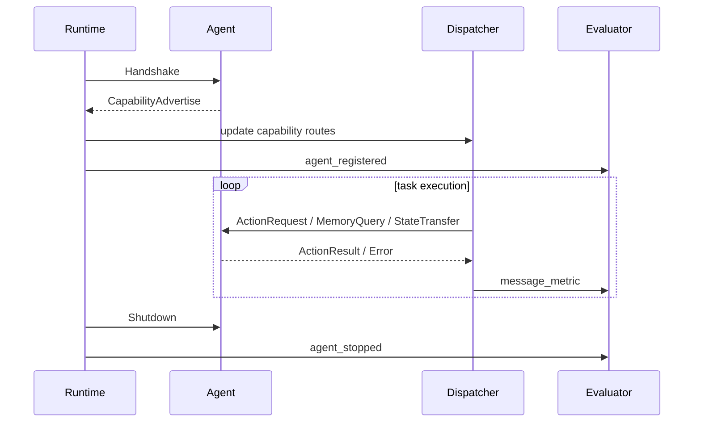
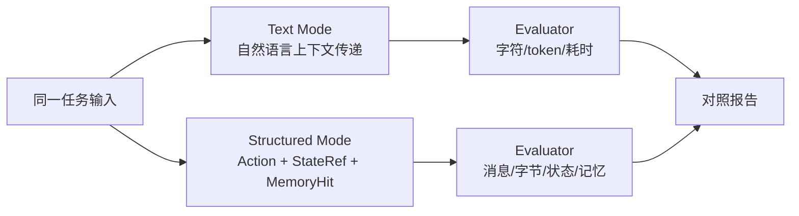
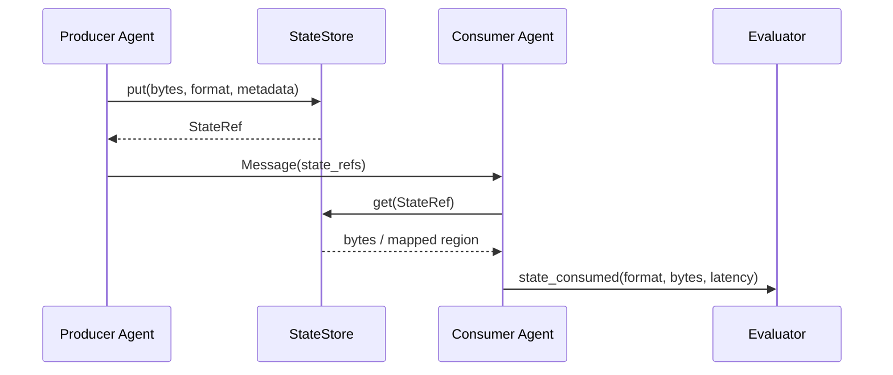
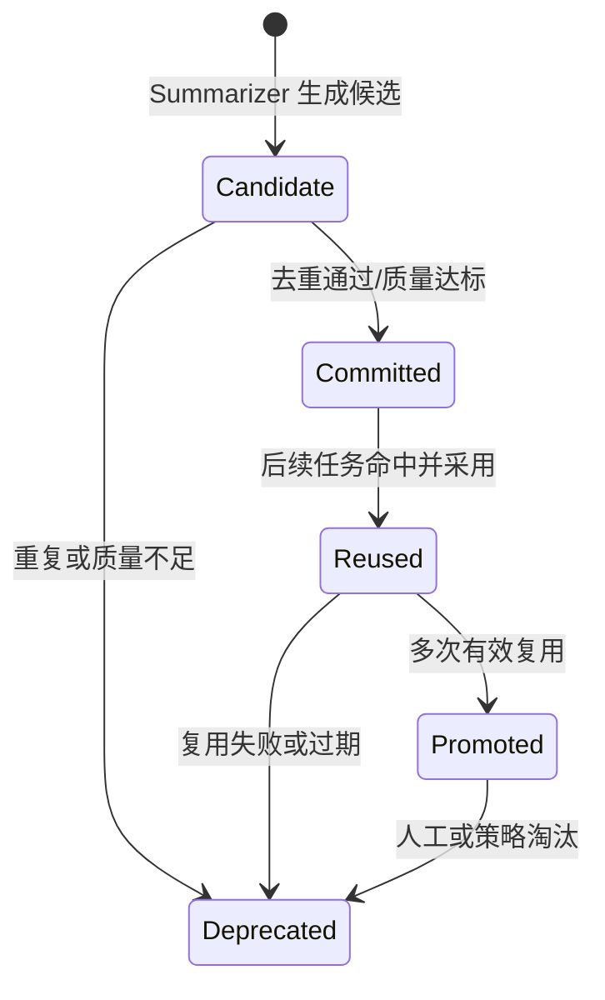

# MemLink 系统架构设计

## 1. 架构目标与赛题映射

MemLink 是一套面向多智能体协作的低开销通信、非文本状态传递与共享记忆复用系统。系统不是传统工作流编排器，而是多 Agent 协作基础设施：通过结构化协议压缩 Agent 间通信，通过 `StateRef` 传递 embedding、任务图、证据包等非文本中间状态，通过共享记忆沉淀跨任务可复用知识，并用内建评测系统量化通信、时延和复用收益。

本架构面向 Rust 2024 Edition 实现。设计分为三档：

- **MVP 必做**：单机异步运行时、结构化协议、进程内状态仓库、SQLite 记忆、可复现实验。
- **系统技术强化**：Unix Domain Socket、mmap/共享内存状态传递、WASM/WASI 沙箱、eBPF 观测。
- **生产演进**：多进程/多节点 Agent、外部向量数据库、权限隔离、OpenTelemetry 与长期审计。

### 1.1 核心创新链路


### 1.2 赛题要求映射

| 赛题要求 | 架构模块 | 验证方式 |
| --- | --- | --- |
| 不少于 3 个 Agent 协同 | `memlink-runtime`、默认 Agent 集 | 至少 Planner/Retriever/Executor/Summarizer 中 3 类参与任务 |
| 结构化通信协议 | `memlink-protocol` | 消息包含动作、参数、结果、能力描述与握手能力发现 |
| 纯文本与结构化双模式 | `RunMode` + evaluator | 同任务分别运行 `text` 与 `structured` 模式 |
| 非文本状态传递 | `memlink-state`、`StateRef` | 记录状态传递次数、格式、字节数和消费方 |
| 共享记忆存储检索复用 | `memlink-memory` | 关键词、标签、语义检索与 reuse event |
| 2 组关联连续任务 | `memlink-evaluator`、benchmark suite | 知识检索类与代码分析类任务组 |
| 性能统计展示 | event log + report | 输出消息数、token/字符、耗时、命中率、提升比例 |
| 不少于 10 轮连续任务 | benchmark runner | 10 轮连续执行，失败不中断实验报告 |
| 系统技术加分 | transport/sandbox/observability | Unix Socket、共享内存、WASM、eBPF 作为增强项 |

### 1.3 设计原则

- **协议优先**：Agent 协作默认传递强类型动作与结构化结果，避免长文本上下文透传。
- **状态引用优先**：大对象通过 `StateRef` 传递句柄，消息只携带元数据与校验信息。
- **记忆闭环**：记忆从候选、提交、复用到质量更新形成生命周期，不只保存最终答案。
- **评测内建**：所有消息、状态、记忆和工具执行都产生可复算事件。
- **MVP 可落地**：首版不依赖共享内存、WASM 或 eBPF 即可跑通完整实验。
- **增强可替换**：通信、状态、向量索引、沙箱和观测均通过 trait 抽象替换。

## 2. 总体架构与分层设计

MemLink 采用五层架构：Agent 层负责角色能力，协作协议层负责消息与路由，状态与记忆层负责中间表示和长期知识，执行隔离层负责 CodeAct 与工具调用，评测观测层贯穿全链路。



### 2.1 单向依赖规则

- Agent 只能通过 `AgentContext` 访问 runtime、state、memory、sandbox 和 evaluator。
- Protocol 不依赖具体 Agent，不包含业务逻辑。
- State store 只管理临时或半长期中间状态；Memory store 管理可复用知识。
- Evaluator 只订阅事件，不参与业务决策，避免评测逻辑污染执行路径。
- Sandbox 不直接写 memory；执行结果先返回 Executor，再由 Summarizer/Memory 策略决定是否沉淀。

### 2.2 运行模式

系统用统一 runtime 支持两种模式，确保评测公平：

```rust
pub enum RunMode {
    Text,
    Structured,
}
```

- `Text`：Agent 间 payload 使用自然语言描述上下文、证据和结果，不传递 `StateRef`，不写入或复用结构化共享记忆。
- `Structured`：Agent 间 payload 使用 `ActionRequest`、`ActionResult`、`MemoryHit` 等强类型结构，大对象通过 `StateRef` 传递，并写入/复用 SQLite 共享记忆。
- 两种模式共享同一任务输入、Agent 集、工具集合、超时策略和 evaluator。

## 3. 多 Agent 运行时

### 3.1 Agent 角色与职责

| Agent | 职责 | 关键输入 | 关键输出 |
| --- | --- | --- | --- |
| Planner | 拆解任务、选择能力、编排步骤 | 用户任务、能力表、记忆命中 | 任务计划、动作请求、依赖图 |
| Retriever | 检索共享记忆与外部资料 | 查询、标签、embedding、任务主题 | 记忆命中、证据包、来源信息 |
| Executor | 执行工具、CodeAct 或数据处理 | 动作参数、状态引用、沙箱策略 | 工具结果、产物状态、诊断信息 |
| Summarizer | 聚合结果、生成输出、抽取记忆 | 计划、证据、工具结果、历史记忆 | 最终回答、记忆候选、评测摘要 |

MVP 至少启用 Planner、Retriever、Summarizer；涉及代码或工具实验时启用 Executor。

### 3.2 核心接口

```rust
pub trait Agent: Send + Sync {
    fn id(&self) -> AgentId;
    fn role(&self) -> AgentRole;
    fn capabilities(&self) -> Vec<Capability>;
    async fn handle(&self, ctx: AgentContext, msg: Message) -> Result<Message, AgentError>;
}

pub struct AgentContext {
    pub trace: TraceContext,
    pub mode: RunMode,
    pub state: Arc<dyn StateStore>,
    pub memory: Arc<dyn MemoryStore>,
    pub evaluator: Arc<dyn EvaluatorSink>,
    pub sandbox: Option<Arc<dyn Sandbox>>,
}
```

### 3.3 生命周期与调度



调度器职责：

- 根据 `Target::Agent` 精确路由，或根据 `Target::Capability` 匹配 Agent。
- 为每条消息注入 `TraceContext`，包含 `experiment_id`、`task_id`、`trace_id`、`span_id`。
- 执行超时、有限重试、幂等去重和结构化错误返回。
- 在 structured mode 中优先传递 `StateRef`；在 text mode 中将必要上下文转为文本。

## 4. 结构化通信协议

### 4.1 协议边界

`memlink-protocol` 定义跨 Agent 协作的稳定 wire model。它只描述“谁请求谁做什么、输入是什么、结果是什么、关联状态在哪里”，不绑定具体 LLM、工具或存储实现。

### 4.2 协议版本与兼容

```rust
pub struct ProtocolEnvelope {
    pub version: ProtocolVersion,
    pub trace: TraceContext,
    pub message: Message,
}

pub struct ProtocolVersion {
    pub major: u16,
    pub minor: u16,
}
```

兼容规则：

- `major` 不一致时拒绝握手。
- `minor` 不一致时允许向后兼容字段，未知字段忽略但记录事件。
- MVP 使用 `serde` + JSON 作为调试编码，structured 实验使用 `postcard` 或 `bincode` 统计二进制字节数。

### 4.3 消息模型

```rust
pub struct Message {
    pub message_id: MessageId,
    pub from: AgentId,
    pub to: Target,
    pub kind: MessageKind,
    pub payload: Payload,
    pub state_refs: Vec<StateRef>,
    pub metrics: MessageMetrics,
    pub created_at: Timestamp,
}
```

`MessageKind` 包括：

- `Handshake`：Agent 与 runtime 建立协议会话。
- `CapabilityAdvertise`：声明角色、动作、输入输出 schema 和状态格式。
- `ActionRequest`：请求执行结构化动作。
- `ActionResult`：返回结构化结果、状态引用和记忆候选。
- `StateTransfer`：通知消费方读取非文本状态。
- `MemoryQuery`：请求记忆检索。
- `MemoryHit`：返回可复用记忆及命中原因。
- `Error`：返回可重试性、降级建议和诊断引用。

### 4.4 能力与动作

```rust
pub struct Capability {
    pub agent_id: AgentId,
    pub role: AgentRole,
    pub action: ActionType,
    pub input_schema: SchemaRef,
    pub output_schema: SchemaRef,
    pub accepted_state_formats: Vec<StateFormat>,
    pub cost_hint: CostHint,
}
```

MVP 动作集合：

- `PlanTask`
- `SearchMemory`
- `SearchExternal`
- `ExtractEvidence`
- `ExecuteTool`
- `Summarize`
- `StoreMemory`
- `EvaluateRun`

### 4.5 Text 与 Structured 对照流程



公平性约束：

- 两种模式使用相同任务文件和同一组 Agent。
- 工具调用和外部检索能力一致。
- 随机种子、超时、最大轮数和终止条件一致。
- 所有差异都来自通信表示、状态传递和记忆复用方式。

## 5. 非文本状态交换

### 5.1 设计目标

非文本状态交换减少中间结果在 Agent 间反复文本化。消息只携带 `StateRef`，实际数据保存在 state store、mmap 文件、共享内存或向量索引中。

适用对象：

- embedding、语义向量、稀疏向量。
- 任务 DAG、规划图、依赖图。
- 检索证据包、文档片段集合。
- 工具输出、表格、日志、代码执行产物。
- 记忆候选的向量表示。

### 5.2 StateRef 模型

```rust
pub struct StateRef {
    pub state_id: StateId,
    pub producer: AgentId,
    pub format: StateFormat,
    pub shape: Option<Vec<usize>>,
    pub byte_len: u64,
    pub transport: StateTransport,
    pub checksum: Checksum,
    pub created_at: Timestamp,
    pub expires_at: Option<Timestamp>,
}
```

```rust
pub trait StateStore: Send + Sync {
    async fn put(&self, bytes: Bytes, meta: StateMeta) -> Result<StateRef, StateError>;
    async fn get(&self, state_ref: &StateRef) -> Result<Bytes, StateError>;
    async fn pin(&self, state_id: StateId, ttl: Duration) -> Result<(), StateError>;
    async fn delete_expired(&self) -> Result<usize, StateError>;
}
```

### 5.3 实现分层

| 阶段 | 传输方式 | 用途 |
| --- | --- | --- |
| MVP | `InMemory` + `MmapFile` | 快速跑通状态引用、字节统计和 checksum 校验 |
| 系统强化 | `UnixSocketFd` + `SharedMemory` | 多进程 Agent 间传递大对象，减少复制 |
| 生产演进 | 外部对象存储 + 分布式向量索引 | 多节点状态读取与长期索引 |

Embedding 生成策略：

- 默认提供 deterministic hash embedding，保证离线实验可复现。
- 可配置本地 embedding 模型或外部 embedding API。
- 所有 embedding 记录模型名、维度、生成时间和配置 hash。

### 5.4 状态交换流程



约束：

- 读取方必须校验 `checksum` 和 `byte_len`。
- 临时状态必须有 `expires_at`，长期知识应转入 memory。
- 生产者不能假设消费者一定读取状态，读取事件由 evaluator 独立记录。

## 6. 共享记忆系统

### 6.1 记忆模型

```rust
pub struct MemoryUnit {
    pub memory_id: MemoryId,
    pub source_agent: AgentId,
    pub created_at: Timestamp,
    pub task_topic: String,
    pub summary: String,
    pub tags: Vec<String>,
    pub keywords: Vec<String>,
    pub content_hash: ContentHash,
    pub embedding_ref: Option<StateRef>,
    pub evidence_refs: Vec<EvidenceRef>,
    pub payload_ref: Option<StateRef>,
    pub lifecycle: MemoryLifecycle,
    pub quality_score: f32,
    pub reuse_count: u64,
}

pub enum MemoryLifecycle {
    Candidate,
    Committed,
    Reused,
    Promoted,
    Deprecated,
}
```

必备元数据包括：记忆 ID、来源 Agent、创建时间、任务主题、摘要描述。`content_hash` 用于去重，`quality_score` 与 `reuse_count` 用于后续排序。

### 6.2 MemoryStore 接口

```rust
pub trait MemoryStore: Send + Sync {
    async fn store_candidate(&self, candidate: MemoryCandidate) -> Result<MemoryId, MemoryError>;
    async fn commit(&self, memory_id: MemoryId) -> Result<(), MemoryError>;
    async fn search(&self, query: MemoryQuery) -> Result<Vec<MemoryHit>, MemoryError>;
    async fn record_reuse(&self, event: MemoryReuseEvent) -> Result<(), MemoryError>;
}
```

MVP 存储：

- SQLite 保存 `memories`、`memory_tags`、`memory_keywords`、`memory_reuse_events`、`evidence_refs`。
- 本地 HNSW 或内存向量索引保存 embedding，并用 `memory_id` 回连 SQLite。
- 无向量依赖时退化为关键词 + 标签检索，仍可完成基础验收。

### 6.3 检索与排序

支持三类召回：

- **关键词召回**：主题、摘要、关键词倒排。
- **标签召回**：任务类型、领域、Agent 角色、策略类型。
- **语义召回**：query embedding 与 memory embedding 相似度。

默认混合排序：

```text
score = 0.45 * semantic_score
      + 0.25 * keyword_score
      + 0.15 * tag_score
      + 0.10 * quality_score
      + 0.05 * recency_score
```

质量更新：

- Agent 采用记忆并成功完成任务：提高 `quality_score`，增加 `reuse_count`。
- Agent 命中但拒绝使用：记录拒绝原因，不直接降权。
- 记忆导致错误或过期：标记 `Deprecated`，默认不再召回。

### 6.4 记忆生命周期



写入策略：

- 任务结束时由 Summarizer 抽取候选记忆。
- MemoryStore 基于 `content_hash`、相似摘要和证据 hash 去重。
- 候选必须包含主题、摘要、来源 Agent、标签和至少一种检索线索。
- 策略、证据链、结论和可复用工具步骤优先沉淀。

复用策略：

- Planner 在任务开始阶段查询相关记忆，用于减少规划和重复检索。
- Retriever 在外部检索前查询历史证据，命中足够高时跳过或缩小检索。
- Executor 可复用历史工具策略，但执行结果必须重新验证。
- Summarizer 标记最终结论中哪些部分来自历史记忆复用。

## 7. CodeAct 与受限执行

### 7.1 执行目标

CodeAct 允许 Agent 生成代码完成数据处理、验证、转换或本地工具调用。为了可复现和降低误操作风险，所有可执行代码必须经过 sandbox 模块。当前 MVP 的受限子进程后端不是 WASM、容器或虚拟机级强隔离，不应用于执行不可信代码。

### 7.2 Sandbox 接口

```rust
pub trait Sandbox: Send + Sync {
    async fn execute(&self, request: SandboxRequest) -> Result<SandboxResult, SandboxError>;
}

pub struct SandboxRequest {
    pub code: String,
    pub language: CodeLanguage,
    pub input_refs: Vec<StateRef>,
    pub limits: ResourceLimits,
    pub network: bool,
}
```

执行结果：

- 小结果内联到 `SandboxResult.summary`。
- 大结果写入 state store，返回 `StateRef`。
- stdout、stderr、退出码、耗时和资源使用写入 evaluator。

### 7.3 实现分层

| 阶段 | 后端 | 约束 |
| --- | --- | --- |
| MVP | 受限子进程/解释器封装 | 临时目录、清理环境、超时、输出大小限制，Unix 下附加进程组清理与 rlimit |
| 系统强化 | WASM/WASI | 默认无网络、受限文件系统、内存限制 |
| 生产演进 | 容器/gVisor/Firecracker | 强隔离、多租户、审计策略 |

默认安全策略：

- MVP 后端不主动传入网络配置，但进程级强网络隔离需要 WASM/容器后端承接。
- 进程工作目录固定为临时目录，不给仓库根目录写权限；不阻止同用户绝对路径读取。
- 限制 CPU 时间、虚拟内存、文件数、文件大小和输出大小。
- 所有执行请求、拒绝原因和结果都写入 event log。

## 8. 评测与可复现实验

### 8.1 实验控制变量

为保证 text mode 与 structured mode 对比公平，实验必须固定：

- 同一任务输入、任务顺序和任务数量。
- 同一 Agent 集合和工具集合。
- 同一 embedding 配置或 deterministic fallback。
- 同一随机种子、超时、最大步骤数和失败策略。
- 同一记忆初始状态；当前 MVP 仅 structured mode 写入和复用共享记忆，text mode 作为无共享记忆基线。

### 8.2 指标与公式

| 指标 | 来源 | 公式/口径 |
| --- | --- | --- |
| `message_count` | dispatcher event | Agent 间消息总数 |
| `text_chars` | protocol metrics | 文本 payload 字符数 |
| `estimated_tokens` | protocol metrics | 中文按字符、英文按 4 字符估算，或使用指定 tokenizer |
| `encoded_bytes` | protocol metrics | structured 编码后字节数 |
| `state_transfer_count` | state event | `StateRef` 被发送或消费次数 |
| `state_transfer_bytes` | state event | 被消费状态的 `byte_len` 总和 |
| `task_duration_ms` | runtime event | 任务开始到结束耗时 |
| `memory_hit_rate` | memory event | `hit_count / query_count` |
| `effective_reuse_rate` | memory event | `adopted_hit_count / hit_count` |
| `tool_reduction_rate` | sandbox event | `1 - structured_tool_count / text_tool_count` |

核心提升公式：

```text
text_saving = 1 - structured_text_chars / text_mode_text_chars
byte_saving = 1 - structured_encoded_bytes / text_mode_encoded_bytes
latency_improvement = 1 - structured_duration_ms / text_mode_duration_ms
effective_reuse_rate = adopted_memory_hits / total_memory_hits
```

### 8.3 实验任务组

任务组 A：关联知识检索与总结。

- A1：检索主题资料，整理证据链并生成总结。
- A2：对同主题相邻问题追问，复用 A1 证据和摘要。
- A3：对 A1/A2 结论做对比或更新，验证历史证据复用。

任务组 B：代码分析与策略复用。

- B1：分析代码片段或项目模块，执行工具检查并生成修复策略。
- B2：处理相似 bug 或变体需求，复用 B1 的分析路径和工具策略。
- B3：沉淀“问题模式—检查方法—修复建议”策略型记忆。

### 8.4 10 轮连续任务 Runner

- 每轮生成独立 `task_id`，共享同一个 `experiment_id`。
- 任务失败不终止 suite，记录失败原因并继续下一轮。
- 每轮结束 flush event log、memory reuse event 和 state metadata。
- 临时 state 按 TTL 清理，长期 memory 保留给后续任务使用。
- 最终报告包含单轮指标、聚合指标、失败列表和提升比例。

### 8.5 报告产物

- `events.jsonl`：完整事件日志，可重新计算所有指标。
- `report.md`：人类可读实验报告，包含对照表、趋势、提升比例和结论。
- `memory_audit.jsonl`：记忆写入、命中、采用、拒绝与质量变化记录。

## 9. Rust 工程实现建议

### 9.1 MVP Workspace

```text
memlink/
  crates/
    memlink-protocol/   # Message、Capability、Action、TraceContext、RunMode
    memlink-runtime/    # Agent trait、dispatcher、任务 runner
    memlink-state/      # StateRef、StateStore、InMemory/Mmap 实现
    memlink-memory/     # MemoryUnit、MemoryStore、SQLite/向量适配
    memlink-evaluator/  # Event、Metric、report 生成
    memlink-cli/        # run、bench、memory search、report 命令
  docs/
    ARCHITECTURE.md
```

增强阶段再增加：

- `memlink-sandbox`：WASM/WASI 与受限子进程执行。
- `memlink-transport`：Unix Socket、FD passing、共享内存传输。
- `memlink-observe`：OpenTelemetry/eBPF 观测适配。
- `memlink-agents`：默认 Agent 实现与实验任务模板。

### 9.2 CLI 设计

```text
memlink run --mode text --task-file tasks/a1.toml
memlink run --mode structured --task-file tasks/a1.toml
memlink bench --suite suites/linked_tasks.toml --rounds 10
memlink memory search --query "..." --tags research,summary
memlink report --experiment-id EXP_ID --output report.md
```

### 9.3 配置设计

```toml
[runtime]
max_concurrent_tasks = 4
default_timeout_ms = 30000
max_steps_per_task = 32

[protocol]
encoding = "postcard"
json_debug = true
version = "1.0"

[state]
transport = "in_memory"
max_temp_bytes = 1073741824
default_ttl_secs = 3600

[memory]
metadata_store = "sqlite"
vector_index = "in_memory_hnsw"
embedding = "deterministic_hash"

[sandbox]
backend = "restricted_process"
cpu_time_ms = 5000
memory_mb = 256
network = false

[evaluator]
event_log = "events.jsonl"
report = "report.md"
```

配置优先级：CLI 参数 > 环境变量 > 配置文件 > 默认值。

## 10. 稳定性、降级与安全

### 10.1 结构化错误

```rust
pub struct ProtocolError {
    pub code: ErrorCode,
    pub message: String,
    pub retryable: bool,
    pub fallback_action: Option<ActionType>,
    pub diagnostics_ref: Option<StateRef>,
}
```

常见错误：

- `CapabilityNotFound`
- `InvalidPayload`
- `StateExpired`
- `StateChecksumMismatch`
- `MemoryUnavailable`
- `SandboxDenied`
- `ActionTimeout`

### 10.2 降级路径

| 故障 | 降级策略 |
| --- | --- |
| 二进制协议编码失败 | 降级 JSON 编码并记录 `protocol_fallback` |
| 状态引用过期 | 请求生产者重放或改用摘要文本 |
| 向量检索不可用 | 使用关键词 + 标签检索 |
| SQLite memory 不可用 | 继续执行任务，但禁用跨任务复用并记录错误 |
| Sandbox 不可用 | 跳过 CodeAct，返回可解释错误和替代建议 |
| 单个 Agent 失败 | dispatcher 返回结构化错误，Planner 重规划或终止当前步骤 |

### 10.3 数据与权限安全

- 临时 state 按 TTL 清理，大对象默认不写入长期 memory。
- 记忆写入保留证据引用和来源，避免不可追溯结论污染记忆库。
- MVP 受限子进程使用临时目录、清理环境、资源上限和超时；强网络/文件系统隔离由后续 WASM/容器后端提供。
- event log 可包含任务摘要和指标，但敏感 payload 应支持脱敏或 hash 化。

## 11. 实施路线与验收标准

### 11.1 Milestones

| 阶段 | 目标 | 产出 |
| --- | --- | --- |
| M1 | 最小多 Agent 协作闭环 | runtime、protocol、3 个 Agent、text/structured 基础对照 |
| M2 | 状态交换与记忆 MVP | `StateRef`、SQLite memory、关键词/标签/语义检索 |
| M3 | 可复现实验闭环 | 两组连续任务、10 轮 runner、events/report 输出 |
| M4 | 系统技术强化 | Unix Socket、mmap/共享内存、WASM/WASI、eBPF demo |
| M5 | 工程化演进 | 多进程部署、权限隔离、外部向量库、OpenTelemetry |

### 11.2 基础验收

- 至少 3 个 Agent 在同一复杂任务中协作完成多步骤流程。
- 支持 `text` 与 `structured` 双模式，并能对同一任务生成对比报告。
- 结构化消息包含动作类型、输入参数、返回结果和能力描述。
- 支持握手、能力发现、协议路由、错误返回。
- 支持至少一种非文本状态传递，并统计次数与数据规模。
- 共享记忆包含记忆 ID、来源 Agent、创建时间、任务主题和摘要。
- 支持关键词、标签、语义相似度检索与跨任务复用。
- 至少 2 组关联连续任务验证重复计算减少和记忆复用收益。
- 稳定执行不少于 10 轮连续任务。
- 输出消息次数、文本通信开销、状态传递、任务耗时、记忆命中率和性能提升。

### 11.3 加分验收

- Agent 间通信支持 Unix Domain Socket。
- 大状态支持 mmap、FD passing 或 POSIX shared memory。
- CodeAct 通过 WASM/WASI 或更强沙箱执行。
- 使用 eBPF 或系统观测工具展示进程、socket、IO 或沙箱行为。
- 支持从本地原型平滑迁移到多进程 Agent 部署。

### 11.4 风险控制

| 风险 | 控制方式 |
| --- | --- |
| 协议过早复杂化 | MVP 只实现核心消息，扩展字段保持可选 |
| embedding 不稳定 | deterministic hash embedding 作为默认 fallback |
| 记忆污染 | 生命周期、去重、质量分和复用反馈共同控制 |
| 沙箱成本过高 | 先用受限子进程，增强阶段替换 WASM/WASI |
| 指标不公平 | 固定任务、工具、随机种子、超时和终止条件 |
| 系统技术强化拖慢 MVP | Unix Socket、共享内存、eBPF 均作为 M4 加分项 |

## 12. 总结

MemLink 的架构核心是“结构化协议压缩通信、非文本状态引用减少转换、共享记忆沉淀经验、评测系统量化收益”。MVP 以 Rust 2024 单机异步系统快速跑通完整闭环；增强阶段再引入 Unix Socket、共享内存、WASM 沙箱和 eBPF 观测，展示系统层创新。该分层设计既能满足赛题硬性要求，也为后续工程化和生产化演进保留清晰接口。
